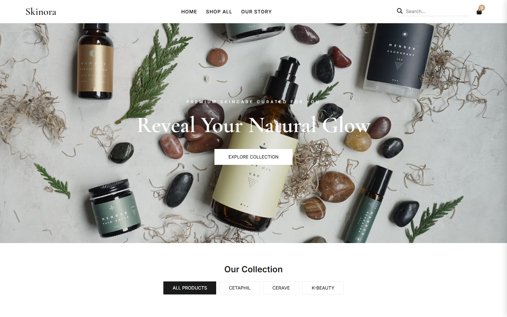
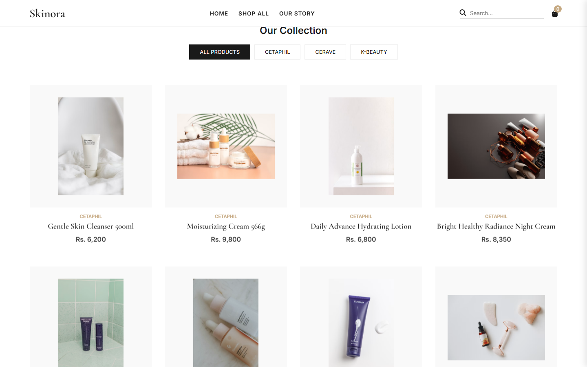
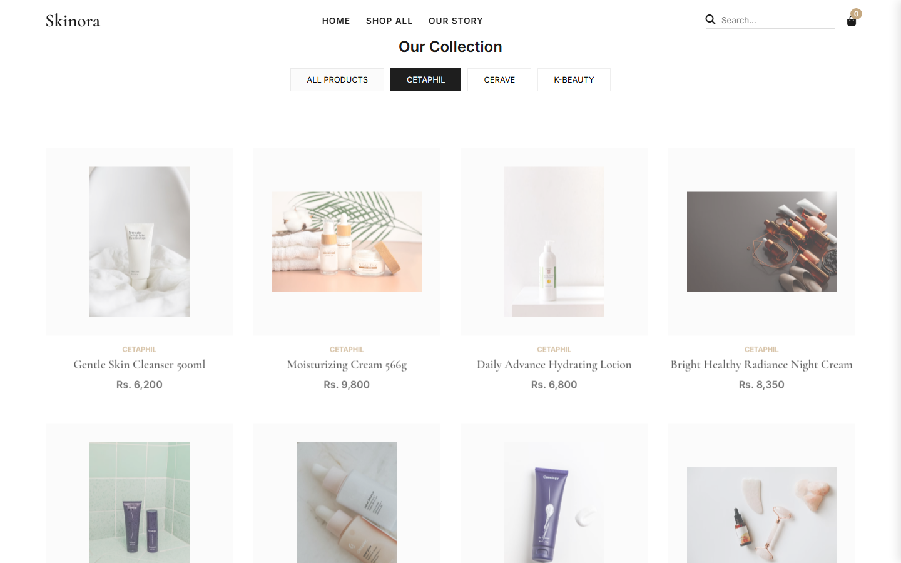
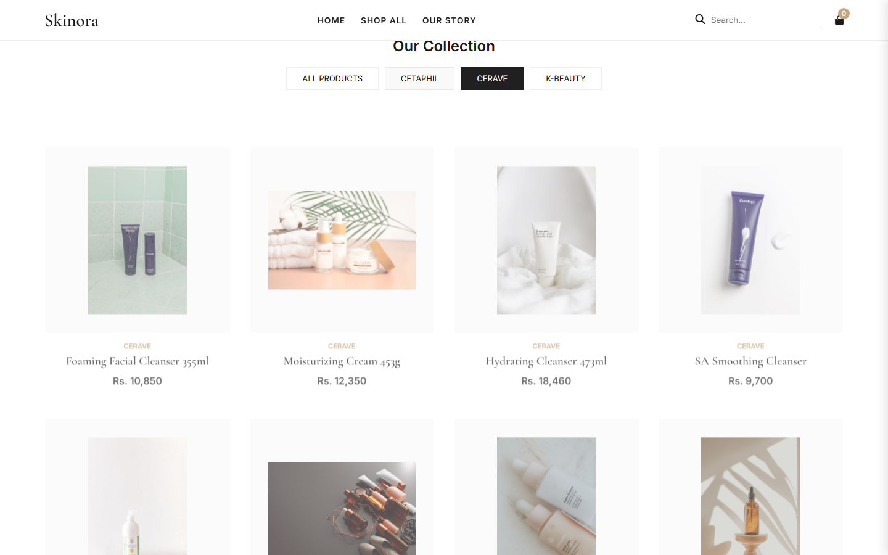
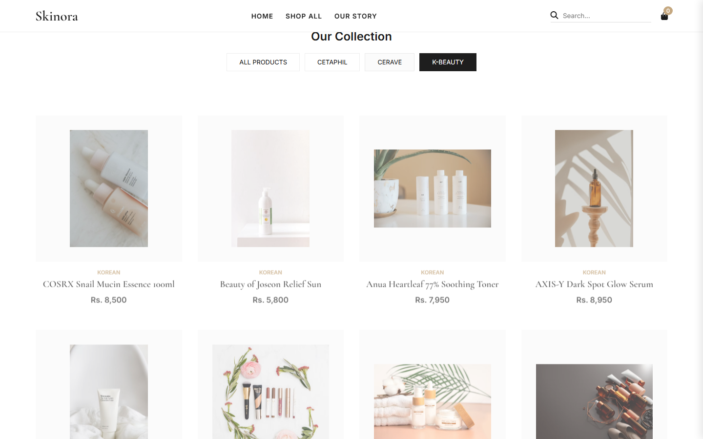
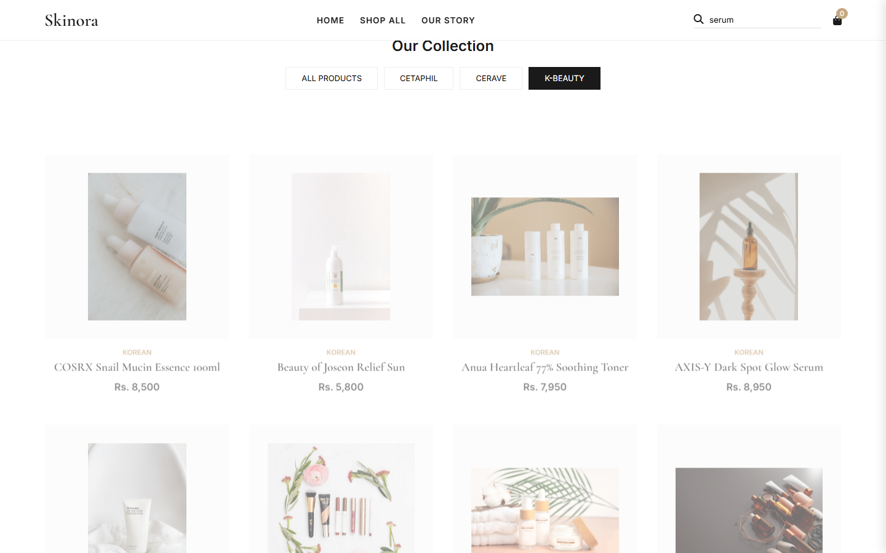
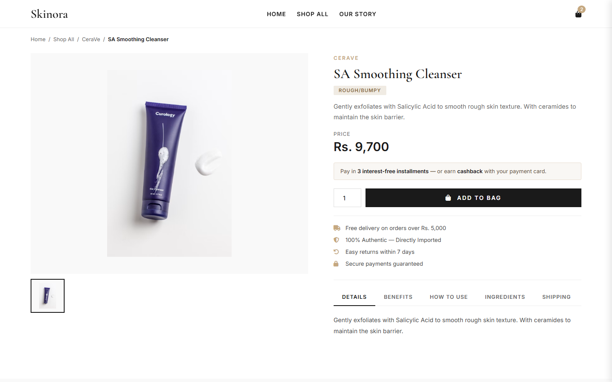
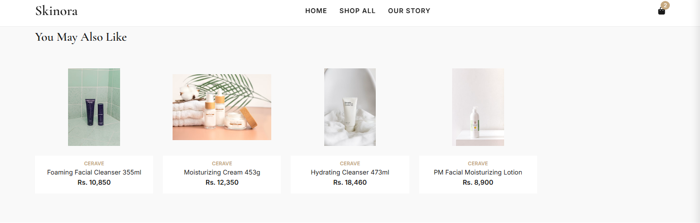
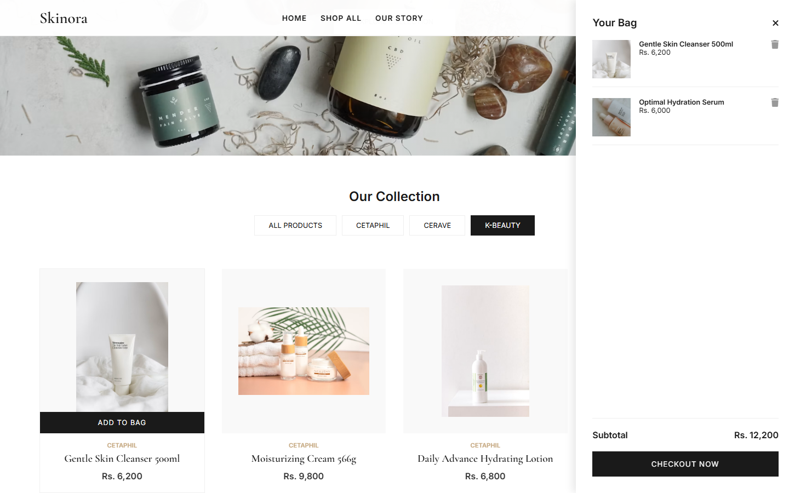
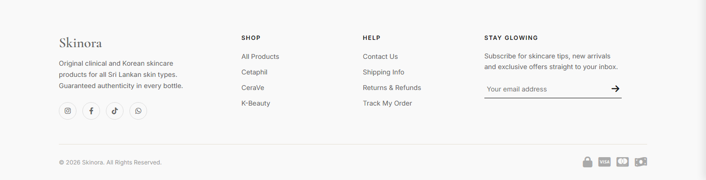

# Skinora

Skinora is a front-end e-commerce demo for a Sri Lankan skincare store, offering clinical (Cetaphil, CeraVe) and K-Beauty products. It's built as static HTML/CSS/JavaScript with no build step or backend required.

## Features

- **Product catalog** — 36 products across three categories (Cetaphil, CeraVe, K-Beauty), 12 per category, with brand filtering and live search.
- **Product detail pages** — image gallery, pricing, skin-type badge, tabbed details (Description, Benefits, How to Use, Ingredients, Shipping), and related products.
- **Shopping bag** — add/remove items, persisted in `localStorage`, with a slide-out cart panel and running subtotal.
- **Newsletter signup** in the footer.
- Responsive layout for mobile and desktop.

## Screenshots

### Home Page

### Category Filters

### Search

### Product Details Page

### Shopping Cart

### Footer

## Tech Stack

- Plain HTML, CSS, and vanilla JavaScript (no frameworks, no build tools)
- [Google Fonts](https://fonts.google.com/) (Cormorant Garamond, Inter)
- [Font Awesome](https://fontawesome.com/) for icons
- [AOS](https://michalsnik.github.io/aos/) for scroll animations

